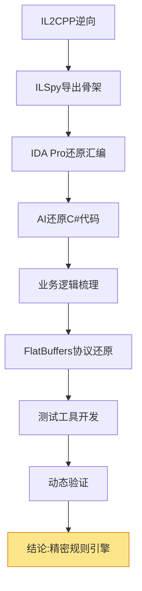

> **【游戏逆向笔记】** 是 lxraa 的技术分享系列，记录"我"习得老爹的黑客技艺后，在游戏逆向领域的探索笔记，基于真实游戏逆向分析过程的半虚构日记式写作。  
> （友情提示）读完之后，你可能一时半会儿都不太想单纯「打游戏」了。

---


## 上篇回顾

在上篇中，我接受了老张的挑战，开始验证Roy\*l M\*\*的螺旋桨棋子是否真的是"AI"。

但静态分析只能告诉我"代码怎么写的"，不能证明"它真的这么运行"。

要完整验证这套权重系统，我需要从"逆向分析"切换到"动态测试"。

---

## 六、工具链：关卡编辑器

要测试，第一个问题就是：如何控制测试环境？

我需要修改关卡数据。

我在反编译的代码里找到了`LevelDataManager.LoadLevel()`方法：

```csharp
public LevelData LoadLevel(int levelNumber)
{
    string path = $"{levelNumber}";
    TextAsset textAsset = Resources.Load<TextAsset>(path);
    byte[] bytes = textAsset.bytes;
    ByteBuffer buffer = new ByteBuffer(bytes);
    FTiledLevel flatLevel = FTiledLevel.GetRootAsFTiledLevel(buffer);
    return ConvertToLevelData(flatLevel);
}
```

`FTiledLevel`——FlatBuffers格式。

游戏开发者有`.fbs`协议文件，但我没有。

不过我可以反推。

FlatBuffers的编译器`flatc`会把`.fbs`协议文件编译成对应语言的类。关键点在于，**这个编译过程是不丢信息的**——每个字段的名称、类型、偏移量、默认值，都会1:1映射到生成的代码里。

最明显的证据是`CreateFTiledLevel()`方法。这个方法的参数列表，就是`.fbs`文件里所有字段的完整定义。参数的顺序、类型、命名，都和原始协议文件一致。

换句话说，只要我能找到这个Create方法，就能完整还原`.fbs`文件。

我又一次把任务交给AI。

让AI读取`CreateFTiledLevel()`方法的参数列表，结合所有访问`FTiledLevel`字段的代码，得到了一个228行的`.fbs`文件。

**FlatBuffers关卡数据协议：**

[level_data.fbs - 完整协议定义（228行）](/assets/game-reverse/001/level_data.fbs)

关键结构节选：

```flatbuffers
// 主要的关卡结构
table FTiledLevel {
  name:string;
  move:int;                    // 移动次数
  goals:[FGoalData];           // 关卡目标
  grid:FTiledGrid;             // 棋盘布局
  predefined:[FTiledPredefined]; // 预定义元素
  sets:[FTiledSet];            // 棋子集合
  colors:[int];                // 颜色配置
  // ... 50+ 字段定义
}

root_type FTiledLevel;
```

--- 

有了协议文件，我就可以：

1. 解析游戏的关卡数据
2. 修改关卡参数（比如把步数改成3000步）
3. 创建自定义关卡来测试特定的权重计算场景

我需要一套完整的测试工具链。

**第一步，获取关卡数据样本**。我在Roy\*l M\*\*的包里翻出了所有关卡数据文件——几千个关卡，每个都是FlatBuffers二进制格式。这些真实关卡数据能帮我验证还原的`.fbs`协议是否正确。

**第二步，实现序列化/反序列化**。用`flatc`把`.fbs`编译成Python代码，然后写了两个脚本：一个读取游戏的关卡文件并解析成人类可读的JSON，一个把修改后的JSON重新序列化成FlatBuffers二进制。测试了几个真实关卡，序列化→反序列化→再序列化，字节级完全一致。协议还原成功。

**第三步，运行时注入**。用Frida写了个注入脚本，Hook游戏加载关卡的函数，在内存中替换掉原始关卡数据。这样我就不需要重新打包游戏，直接在运行时测试自定义关卡。

测试工具链搭建完成。


> 图：关卡编辑器可视化界面


现在，我可以设计任何我想要的棋盘布局，注入游戏，观察螺旋桨棋子的真实行为。

测试时刻：

双击启动器，选择修改过的64关，点击启动。

手机屏幕亮起，Roy\*l M\*\*启动，进入64关。

左上角的移动次数显示：**3000**。

我笑了，随便点了几下。消除，消除，消除。不到一分钟，三个目标全部完成。

屏幕中央弹出金色的"Level Complete"。

"这就是氪金玩家的视角吗？"我自言自语。


> 图：Frida脚本注入+关卡编辑器+修改后的游戏界面

## 七、真相

至此，我已经完全证明了老张纯属扯淡。

我整理完最后一份文档，打开统计脚本，看着输出结果：

```
分析文件数: 6823
文件总行数: 1025528
总函数数: 64445
已还原函数数: 1392
还原进度: 2.16%
已还原函数有效代码行数: 34670
```

这1392个函数，足够回答老张的问题了。

**验证流程回顾：**



## 八、尾声

我给老张发了条消息。

"验证完了。"

他秒回："怎么样？"

"你说对了一半。"我打字，"螺旋桨棋子确实很聪明。但不是AI。"

"......"

我把一堆文档丢过去。

过了几分钟，他回复："明白了。游戏设计。"

"对。"

停顿了几秒。

"你输了。"我打字，"请吃饭，海底捞。"

"条件是你得给我讲讲那套权重系统。"

"没问题，反正你请客。"

"......"

我关掉聊天窗口，靠在椅子上伸了个懒腰。

窗外天已经黑了。屏幕的光照在脸上，文件夹里一堆文档和代码。

我起身去倒了杯水，回来的时候老爹正好路过。

他扫了眼屏幕上的统计数据，停顿了两秒。

"做完了？"

"嗯。"

"用了多久？"

"一个月。"

他点点头，端着茶杯继续往前走，隐约还哼了两句不知道什么调。

---

## 附录：任务总结

> **任务名称**：Roy\*l M\*\* 螺旋桨棋子算法验证  
> **起因**：老张的都市传说  
> **目标**：证明国王不是AI  
> **预计耗时**：一周  
> **实际耗时**：一个月  
> **任务状态**：✓ 已完成  
> **任务奖励**：老张请的火锅（顺便给他讲权重系统）

### 任务产出物清单

- 📦 [csharp_code.zip](/assets/game-reverse/001/csharp_code.zip) - AI还原的C#代码
- 📦 [Propeller棋子解析.zip](/assets/game-reverse/001/Propeller棋子解析.zip) - 螺旋桨系统完整分析文档
- 📦 [proto-fbs.zip](/assets/game-reverse/001/proto-fbs.zip) - FlatBuffers协议文件
- 📦 [tools.zip](/assets/game-reverse/001/tools.zip) - 关卡编辑器

### 核心发现

**螺旋桨棋子智能决策系统架构**

通过完整还原300+个C#类和81种棋子逻辑，发现螺旋桨棋子系统采用**五层计算架构 + 三层重定向机制**：

**五层权重计算体系：**

1. **策略层**：4种攻击模式
   
   - TNT组合：区域轰炸（PropellerTntStrategy）
   - 垂直火箭组合：整列清除（PropellerRocketStrategy）
   - 水平火箭组合：整行清除（PropellerRocketStrategy）
   - 默认模式：单点精准（PropellerDefaultStrategy）

2. **全局层**：棋盘分数计算（ExplodeTargetFinder）
   
   - FindForExploder()：主入口，选择寻找策略
   - FillScores()：填充整个棋盘的分数数组
   - 火箭模式：FindBestLineTarget()计算最高分行/列
   - 单点模式：FindBestSingleTarget()计算最高分位置

3. **单元格层**：单格权重计算（ExplodeTargetMediator）
   
   - 分层检查：上方道具→当前道具→下方道具
   - 缓存机制：避免同一帧重复计算
   - 阻挡检测：钻头、原木等障碍物
   - 传播计算：果冻传播、TNT范围爆炸

4. **道具层**：81种棋子独立评分（GetExplodeScore虚函数）
   
   - 每个棋子实现自己的GetExplodeScore()方法
   - 基础权重分层：障碍物10000、收集品5000、特殊道具15000
   - 动态调整：根据游戏状态、道具状态、位置环境
   - 28种权重计算模式（如：标准最后一击、复杂条件、分组协同）

5. **影响因子层**：16个Helper系统跨棋子影响
   
   - IceCubeHelper：冰块影响5种特殊道具分数
   - FrogHelper：青蛙收集目标4.4倍加成（868,243→3,838,548）
   - BirdHelper：鸟类道具跨棋子影响
   - 其他13个Helper：各自独立的影响逻辑
   - 总计42个跨棋子影响关系

**三层重定向机制：**

- **策略级重定向**：通关条件优先
  
  - TryRedirectForSoilWinCondition()：土壤最后一层强制重定向
  - TryRedirectForPowerCubeWinCondition()：能量方块通关重定向
  - 目标：确保能完成关卡目标的位置被优先攻击

- **道具级重定向**：道具自身重定向逻辑
  
  - 某些多层障碍物主动让螺旋桨棋子攻击其支撑点
  - 特殊道具（鸟类、青蛙、皇家机器人）触发重新寻找目标
  - 目标：优化攻击路径，提升破坏效率

- **Helper级重定向**：跨道具复杂重定向
  
  - IceCubeHelper最复杂：检查冰块上方收集物品
  - 根据冰块类型（真冰块/假冰块）重定向到特定方向
  - 向上搜索→左右邻居检测→同列最近位置计算
  - 目标：帮助收集物品（青蛙、鸟）正确掉落

**技术复杂度评估**

开发成本：

- 预估开发时间：数年
- 代码规模：64445个函数，100万+行代码
- 调优难度：极高（需大量测试和平衡）

---

**工具链记录**

- Il2CppDumper：元数据提取
- ILSpyCMD：C#反编译
- IDA Pro 9.0：汇编分析
- AI辅助工具：函数体还原
- Frida：动态调试与注入
- Python：脚本编写
- Cursor：LLM + RAG
- IDA Pro MCP：连接AI和IDA

**声明**：本文内容仅供学习和研究使用，请勿用于商业用途或破坏游戏平衡。

---

**代码会说真话。**

**本文为基于真实技术分析的虚构故事，文中截图、图片如有展示，均作技术示意，与具体厂商和项目无直接指向关系。**

**未经授权 禁止转载。**

**版权所有 © lxraa 2025**
